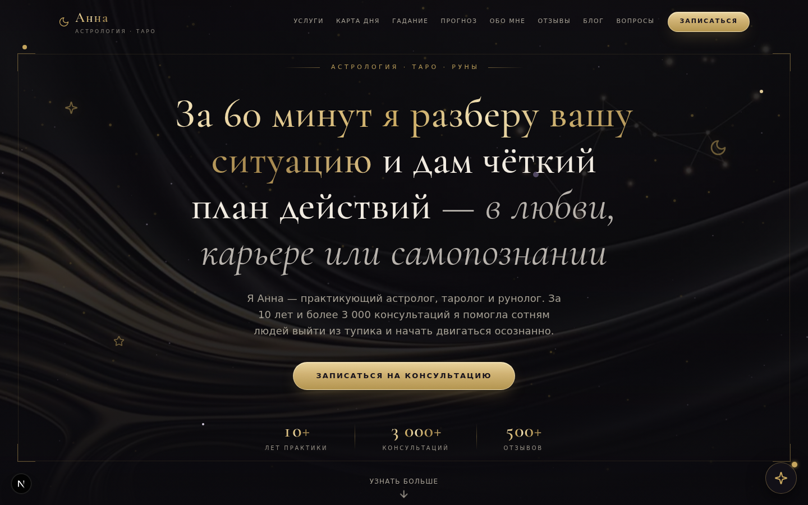
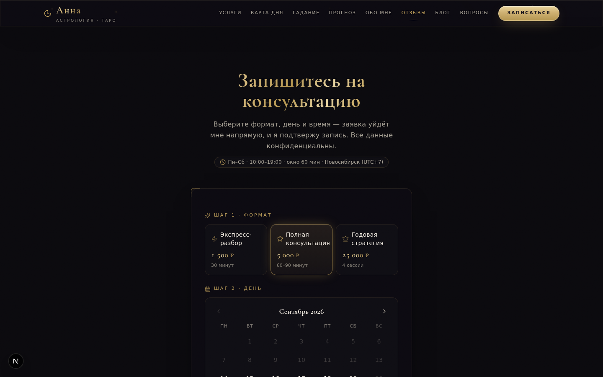
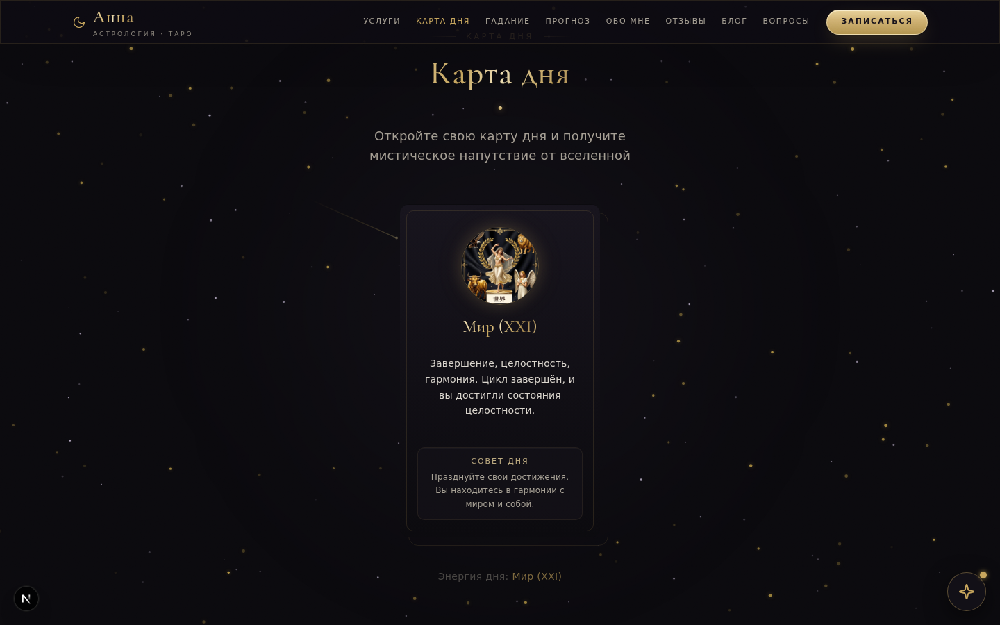
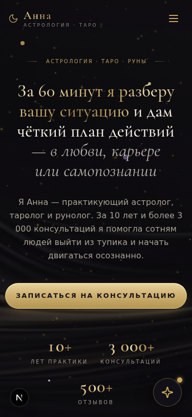

# Астролог Анна — сайт с онлайн-записью

Люксовый одностраничный сайт для практикующего астролога и таролога: онлайн-запись на консультацию с реальными слотами, админ-CRM заявок, интерактивная «Карта дня», лунный календарь, персональный гороскоп и блог со статьями, сгенерированными AI.

<p align="center">
  
</p>

| Онлайн-запись | Карта дня | Мобильная версия |
|---|---|---|
|  |  |  |

## Возможности

**Онлайн-запись (3 шага без перезагрузки страницы)**
- Выбор тарифа → живой календарь свободных слотов → подтверждение с сводкой
- Реальная логика расписания: окно 10:00–19:00, слоты по 60 мин, подготовка 2 часа, бронь максимум на 45 дней вперёд, воскресенье — выходной, часовой пояс Asia/Novosibirsk (UTC+7)
- Атомарная бронь в транзакции Prisma — двойное бронирование одного слота невозможно (ответ `409 conflict` с понятным тостом)
- Rate limiting на эндпоинтах (слоты/бронь), серверная валидация каждой заявки

**Админ-панель `/admin`**
- CRM заявок: статусы, заметки, выгрузка в CSV, удаление; счётчики за неделю
- Генерация статей блога с обложками через AI (z-ai-web-dev-sdk: LLM + генерация изображений)
- Stateless-авторизация: HMAC-подписанный токен с TTL 8 часов, сравнение пароля без утечки по времени (timing-safe)

**Интерактив и контент**
- «Карта дня» — 3D-переворот карты, карта детерминирована по дате (за день не меняется), AI-иллюстрации арканов
- Лунный календарь: фазы Луны и возраст светила рассчитываются астрономически, недельный прогноз
- Персональный гороскоп по дате рождения с эффектом печатной машинки
- Блог со статьями из БД, чтение в модальном окне

**Дизайн и качество**
- Собственная «люкс»-дизайн-система: фольгированная типографика (Cormorant), hairline-рамки с уголками-лучами, металл-кнопки со свип-блеском, орнаментальные разделители, плёночное зерно — без единого внешнего CDN
- Тёмная мистическая тема, звёздное поле на canvas, деликатные микро-анимации (framer-motion, `prefers-reduced-motion` учтён)
- Адаптив от 375px, sticky-футер, семантика и ARIA, золотое `focus-visible` кольцо
- SEO: JSON-LD (Person + WebSite + OfferCatalog), sitemap, robots, OG-изображение; `/admin` закрыт от индексации

## Стек

Next.js 16 (App Router) · TypeScript · Tailwind CSS 4 · shadcn/ui · Prisma + SQLite · Framer Motion · z-ai-web-dev-sdk (LLM, генерация изображений) · bun

## Быстрый старт

Требуется Node.js 20+ (или bun) и Prisma-совместимая среда.

```bash
bun install                # или: npm install
cp .env.example .env       # заполните ADMIN_PASSWORD и ADMIN_SESSION_SECRET
bun run db:push            # создаст SQLite-базу в db/custom.db
bun run dev                # http://localhost:3000
```

Админ-панель: `http://localhost:3000/admin` — пароль из `ADMIN_PASSWORD`.

## Переменные окружения

| Переменная | Назначение |
|---|---|
| `DATABASE_URL` | Строка подключения Prisma (SQLite), путь относительно папки `prisma/` |
| `ADMIN_PASSWORD` | Пароль панели `/admin` (используйте длинную случайную строку) |
| `ADMIN_SESSION_SECRET` | Секрет подписи админ-сессий (`openssl rand -base64 32`) |

## Структура проекта

```
src/
  app/                  # маршруты (App Router) и API-эндпоинты
    api/                # slots, booking, card-of-day, horoscope, articles, chat, admin/*
    admin/              # админ-панель (CRM + блог)
    oferta/             # публичная оферта
  components/
    mystical/           # секции лендинга (hero, услуги, запись, луна, блог…)
    ui/                 # shadcn/ui
  lib/                  # расписание слотов, тарифы, rate-limit, admin-auth, seo
prisma/schema.prisma    # модели: Booking, Article, User
db/                     # SQLite-файл (создаётся db:push, в git не входит)
```

## API (основное)

| Метод | Эндпоинт | Описание |
|---|---|---|
| GET | `/api/slots?month=YYYY-MM` | Свободные дни/слоты месяца |
| POST | `/api/booking` | Бронь слота (409 при конфликте) |
| GET | `/api/card-of-day` | Карта дня (детерминирована по дате) |
| POST | `/api/horoscope` | Расчёт гороскопа по дате рождения |
| GET | `/api/articles` | Публикации блога |
| POST | `/api/chat` | AI-ассистент |

## Примечания

- Проект создан как портфолио: контактные данные и отзывы вымышлены.
- SQLite хранится локально в `db/` (в git не входит). Для продакшена с несколькими инстансами достаточно сменить `provider` в `prisma/schema.prisma` на `postgres`/`mysql`.
- Проверка качества: `bun run lint` — без ошибок и предупреждений.

---

## Авторские права

**© 2026 `Буров Геннадий Владиславович`. Все права защищены** (All rights reserved).

Репозиторий опубликован исключительно в качестве портфолио — для изучения кода и демонстрации навыков. Копирование, переиспользование, распространение и создание производных работ (код, дизайн, тексты, изображения) без письменного разрешения автора запрещены.

Файл `LICENSE` намеренно отсутствует: без открытой лицензии по умолчанию действует режим «все права защищены».
